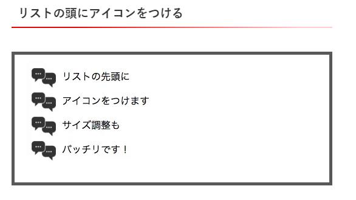

# HTML/CSSの基礎を学ぼう
・githubについて<br>
・絶対パス、相対パスの違いについて


## (3)テキスト内でのポイントや補足説明
- _htmlファイルにcssスタイルを外部適応する理由_<br>
基本的には外部ファイルから読み込む形をとる。理由としてアプリケーション開発の現場では各機能を役割ごとに分離させることにしている。
**可読性**と**独立性**につながる。
- リセットCSS
  ブラウザごとにデフォルトで設定されているcssのスタイルをリセットさせて予期せぬ挙動を防ぐためのもの。
  ```
  <!-- reset.css ress -->
  <link rel="stylesheet" href="https://unpkg.com/ress/dist/ress.min.css" />
  <link href="stylesheet" href="./style.css" />
  ```
 
- ビューポート
  デバイスごとの画面サイズに合わせてwebサイトを表示するための設定
  ```
  <meta name="viewport" content="width=device-width, initial-scale=1, minimum-scale=1, maximum-scale=1, user-scalable=no">
  ```
  ```
  /*-----スマホ向けの記述-----*/
  @media screen and (max-width: 479px) {　/*ウィンドウ幅が0～479pxの場合にCSSを適用*/
  #menu-bg {
  background-color: #00FF00;　/*緑色*/
  }
  ```
- 疑似要素の利点
  - **構造**と**デザイン**を分離可能
  - 検索エンジンに引っかかる*可能性*が低い
    
    
    
    ```
    <ul class="test_list">
    <li class="before_list">リストの先頭に</li>
    <li class="before_list">アイコンをつけます</li>
    <li class="before_list">サイズ調整も</li>
    <li class="before_list">バッチリです！</li>
    ```
    ```
    .before_list:before {
    content:  '';                           /* 空白の要素を作る */
    height: 40px;                           /* 高さ指定 */
    width: 40px;                            /* 幅指定 */
    display:  inline-block;                 /* インラインブロックにする */
    background-image:  url(test-icon.png);  /* 背景画像指定 */
    background-size:  contain;              /* 背景画像サイズ指定 */
    background-repeat:  no-repeat;          /* 背景画像リピート指定 */
    background-position:  center;           /* 背景画像位置指定 */
    vertical-align:  middle;                /* 上下中央揃え */
    margin-right:  10px;                    /* 右側に間を */
    }
    ```

- positionとdisplay
  display:inline-blockの使い方。横並びにしたい要素に直接適用させる。
  ```
  <div class="parent">
            <p class="child">one</p>
            <p class="child">two</p>
            <p class="child">three</p>
    </div>
  ```
  ```
  .child {
    display: inline-block;
    margin-right: 30px;
    margin-left: 30px;
}
  ```

  躓きやすいポイントなので復習を重点的に行う。
- **HTML living standard(HTMLの公式)** に準拠すべき理由(セマンティック(***意図のわかりやすい***)コーディング)
  - **開発者**が読みやすい
  - **機械**が読みやすい
- cssのサイズ単位について<br>
 パターンとしては**絶対値基準**と**相対値基準**の2種類
- widthとheightの使い方の違い
  - width autoとwidth 100%
    width autoとwidth 100%はどちらも親要素を基準とした横幅を取ってくれますが、paddingやborderなどの設定の有無によって挙動が変わります。
    width autoはpaddingやborderも含めたすべての幅を親の幅に合わせます。width autoはcontentで100%です。  
  - height autoとheight 100%
    height autoは子要素の高さによって長さが変化します。
    height 100%は親要素の高さの100%です。  
- margin,padding,content,border<br>
 各要素について図で理解できるようにする。<br>
 横要素のみはmargin autoが使える。この書き方はよく見かける。
- website制作で使用する便利ツール
  - 差分比較difff、Winmerge<br>
    ファイルの差分比較に使う。
  - markup validation service
  - サクラエディタ<br>
    Javaの開発でよく使われる。メモ帳に似ているが便利な使い方が可能。


